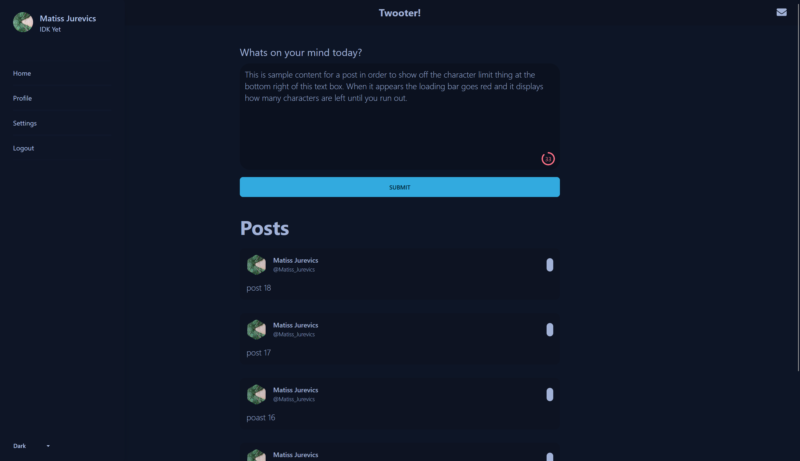

# Twooter - A Twitter clone



## Introduction

Twooter is a Twitter clone that allows you to send short-form messages, images, and videos to your followers. It is a full-stack application that uses the following technologies:
 - Svelte / Sveltekit
 - Tailwind CSS
 - DaisyUI
 - Firebase
 - Svelte-Icons

## Getting Started

In order to run this application, you need to have Node.js installed. You can download it from [here](https://nodejs.org/en/download/). Once you have Node.js installed, you can clone this repository and run the following commands:

```bash
yarn install # Install dependencies
yarn dev # Run the application
```

## Contributing

Feel free to open a pull request if you would like to contribute to this project. If you have any questions, feel free to open an issue.

## License

This project is licensed under the MIT License